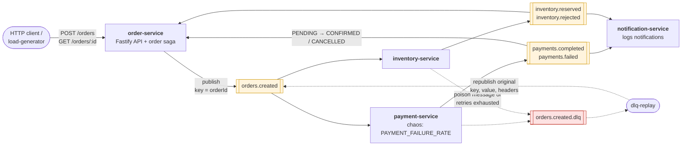
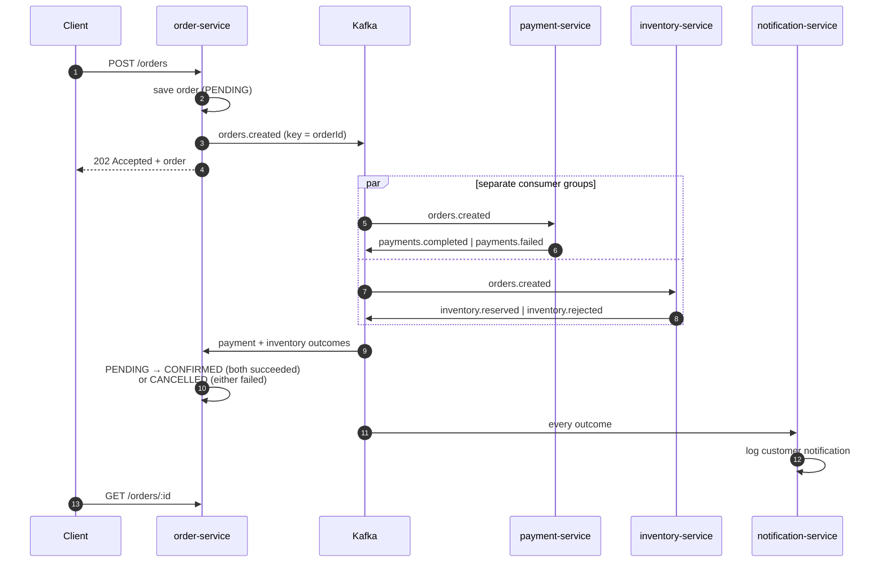

# orderflow — an event-driven order pipeline on Kafka

A small but realistic Kafka demo in **Node.js + TypeScript**. Orders flow through
four services that talk only through Kafka topics, with the reliability patterns
you need in real systems: keyed partitioning, consumer groups, retries with
exponential backoff, dead-letter queues, DLQ replay and idempotent consumers.

```bash
docker compose up -d   # Kafka (KRaft) + Kafka UI
npm run dev            # installs dependencies on first run, then starts all four services
```

Then create an order and watch it move through the pipeline:

```bash
curl -s -X POST localhost:3000/orders -H 'content-type: application/json' \
  -d '{"customerId":"alice","items":[{"sku":"SKU-KEYBOARD","quantity":1,"unitPrice":79.99}]}'
```

Kafka UI runs at <http://localhost:8080>. For a guided tour of happy path, outage,
poison messages, DLQ replay and duplicates, see **[docs/demo-script.md](docs/demo-script.md)**.

## Architecture



Topics are yellow, the dead-letter queue is red. Each service has its own consumer
group (named after the service), and every topic has 3 partitions keyed by
`orderId`. Every consumer follows the same rules: a message it can't decode, or
one that still fails after its retries, goes to `<topic>.dlq`. The diagram shows
only `orders.created.dlq` to keep it readable.

### What happens to one order



## Repository layout

| Path                            | What it is                                                                                   |
| ------------------------------- | -------------------------------------------------------------------------------------------- |
| `packages/contracts`            | Event envelope, zod schemas per event type, topic names, `createEvent` / `decodeEvent`       |
| `packages/kafka-utils`          | kafkajs client, producer, consumer wrapper (retries, backoff, DLQ, idempotency), logging     |
| `services/order-service`        | Fastify API (`POST /orders`, `GET /orders/:id`) and the order state machine                  |
| `services/payment-service`      | Charges orders; has the chaos toggle                                                         |
| `services/inventory-service`    | Reserves stock (all-or-nothing)                                                              |
| `services/notification-service` | Logs a customer notification for every outcome                                               |
| `tools/load-generator`          | Generates orders over HTTP, duplicates, or poison messages; waits and summarizes the results |
| `tools/dlq-replay`              | Inspects DLQs and replays records to their original topic                                    |
| `docs/demo-script.md`           | Step-by-step demo                                                                            |

## Topics

| Topic                | Partitions | Key     | Producer          | Consumer groups                                   |
| -------------------- | ---------- | ------- | ----------------- | ------------------------------------------------- |
| `orders.created`     | 3          | orderId | order-service     | `payment-service`, `inventory-service`            |
| `payments.completed` | 3          | orderId | payment-service   | `order-service`, `notification-service`           |
| `payments.failed`    | 3          | orderId | payment-service   | `order-service`, `notification-service`           |
| `inventory.reserved` | 3          | orderId | inventory-service | `order-service`, `notification-service`           |
| `inventory.rejected` | 3          | orderId | inventory-service | `order-service`, `notification-service`           |
| `<topic>.dlq`        | 1          | orderId | consumer wrapper  | read by `tools/dlq-replay` (`dlq-replay.<topic>`) |

Topics are declared once in [`packages/contracts/src/topics.ts`](packages/contracts/src/topics.ts)
and created by the services at startup; auto-creation is disabled on the broker.
Because every event is keyed by `orderId`, all events for one order land on the same
partition and are processed in order. Each service has its own consumer group, so
every service sees every event, and running more instances of a service spreads
the 3 partitions across them.

## Event envelope

Every message value is a JSON envelope, validated with zod on the way out
(`createEvent`) and on the way in (`decodeEvent`):

```json
{
  "eventId": "0a3d306f-2538-4183-9530-7b3017d1db33",
  "type": "order.created",
  "version": 1,
  "occurredAt": "2026-09-28T10:01:59.260Z",
  "correlationId": "smoke-1",
  "data": {
    "orderId": "f43d58d0-856a-4a56-9f96-6b5c5c89401f",
    "customerId": "alice",
    "items": [{ "sku": "SKU-MOUSE", "quantity": 1, "unitPrice": 25 }],
    "totalAmount": 25,
    "currency": "USD"
  }
}
```

- **eventId** is unique per event and is what consumers de-duplicate on.
- **correlationId** comes from the `x-correlation-id` request header (or is generated)
  and is copied onto every downstream event, so you can grep one order's whole
  journey across all service logs.
- **version** is checked per type; an unknown version is rejected into the DLQ
  instead of being half-understood.
- `event-id`, `event-type`, `event-version` and `correlation-id` are also set as
  Kafka headers, so you can filter them in Kafka UI.

## Reliability patterns

All of these live in [`packages/kafka-utils/src/consumer.ts`](packages/kafka-utils/src/consumer.ts)
(`processMessage`), so every service gets them for free:

1. **Validation.** A message that isn't valid JSON, isn't an envelope, has the wrong
   type for the topic, or has an invalid payload is a _poison message_. It goes
   straight to `<topic>.dlq` (retrying cannot help) and the partition keeps moving.
2. **Idempotency.** Kafka consumers get at-least-once delivery: after a crash or a
   rebalance, messages are delivered again, and producers can write an event twice
   when they retry. Before calling a handler the wrapper checks whether that
   `eventId` was already processed by this consumer group and skips it if so. The
   services also derive their outgoing eventIds from the incoming one
   (`deriveEventId`), so re-processing an event re-emits the _same_ eventIds and
   de-duplication keeps working all the way downstream.
3. **Retries with exponential backoff.** If a handler throws, the wrapper retries
   in-process: `initial × 2^(n-1)`, capped, ±20% jitter, and it heartbeats while
   waiting so the consumer isn't kicked out of the group. A `NonRetryableError`
   skips the retries.
4. **Dead-letter queue.** After `CONSUMER_MAX_RETRIES` the message goes to
   `<topic>.dlq` as a record with the error, the attempt count, the consumer group,
   and the original topic/partition/offset/key/headers/value. The original offset is
   then committed. If the DLQ itself can't be written, the offset is _not_ committed
   and Kafka redelivers, so nothing is silently dropped.
5. **Replay.** `npm run dlq:replay` republishes records exactly as they were (same
   key and headers, so the same eventId) and adds `replayed-from`/`replay-count`
   headers. Consumer groups that already processed the event skip it (see 2).
6. **Graceful shutdown.** On SIGINT/SIGTERM consumers disconnect and leave their
   group, so partitions are reassigned right away instead of after the session
   timeout.

The order saga in [`order.ts`](services/order-service/src/order.ts) is a pure
function: `PENDING` until both answers arrive, then `CONFIRMED` if payment completed
**and** stock was reserved, or `CANCELLED` as soon as either fails. Final states
stay final, and applying the same event twice does nothing.

## Configuration

Everything has a sensible default. To override values, copy `.env.example` to `.env`
(`npm run dev` loads it) or set environment variables.

| Variable                    | Default          | Used by         | Meaning                                                             |
| --------------------------- | ---------------- | --------------- | ------------------------------------------------------------------- |
| `KAFKA_BROKERS`             | `localhost:9092` | all             | Comma-separated bootstrap brokers                                   |
| `ORDER_SERVICE_PORT`        | `3000`           | order-service   | HTTP port                                                           |
| `PAYMENT_FAILURE_RATE`      | `0`              | payment-service | **Chaos toggle**: probability (0–1) that a gateway call throws      |
| `PAYMENT_DECLINE_RATE`      | `0`              | payment-service | Probability that a card is randomly declined (→ `payments.failed`)  |
| `PAYMENT_CARD_LIMIT`        | `2000`           | payment-service | Orders above this amount are always declined                        |
| `CONSUMER_MAX_RETRIES`      | `3`              | all consumers   | Retries after the first attempt before dead-lettering               |
| `CONSUMER_INITIAL_RETRY_MS` | `200`            | all consumers   | First backoff delay                                                 |
| `CONSUMER_MAX_RETRY_MS`     | `5000`           | all consumers   | Backoff cap                                                         |
| `LOG_LEVEL`                 | `info`           | all             | pino level (`debug` shows every publish)                            |
| `LOG_FORMAT`                | pretty           | all             | `json` for newline-delimited JSON (also when `NODE_ENV=production`) |
| `KAFKAJS_DEBUG`             | unset            | all             | Set to anything to see kafkajs internals                            |
| `KAFKA_UI_IMAGE`            | kafbat v1.4.2    | docker compose  | Override the Kafka UI image                                         |

## HTTP API (order-service)

| Method & path                | Description                                                                             |
| ---------------------------- | --------------------------------------------------------------------------------------- |
| `POST /orders`               | Body `{ customerId, items: [{ sku, quantity, unitPrice }], currency? }` → `202` + order |
| `GET /orders/:id`            | Current order state, payment/inventory status and an event history                      |
| `GET /orders?limit=20`       | Most recent orders                                                                      |
| `POST /orders/:id/republish` | **Demo only**: republishes the original `orders.created` event (same eventId)           |
| `GET /health`                | Liveness                                                                                |

Stock (see [`inventory.ts`](services/inventory-service/src/inventory.ts)):
`SKU-KEYBOARD`, `SKU-MOUSE`, `SKU-MONITOR`, `SKU-LAPTOP`, `SKU-HEADSET`, `SKU-WEBCAM`
(only 10 in stock) and `SKU-GPU` (always out of stock).

## Tools

```bash
npm run load -- --help
npm run load                                        # 20 orders at 5/s
npm run load -- -n 200 -r 50 --scenario mixed --wait # includes out-of-stock + over-limit orders, prints a summary
npm run load -- -n 5 --duplicate --wait              # publishes every orders.created twice
npm run load -- --poison 5                           # writes 5 malformed messages to orders.created

npm run dlq:replay                                   # how many records each DLQ holds
npm run dlq:replay -- -t orders.created.dlq --dry-run --reason all
npm run dlq:replay -- -t orders.created.dlq --group payment-service

npm run lag                                          # consumer group offsets and lag
```

## Scripts

| Script                                  | What it does                                                                |
| --------------------------------------- | --------------------------------------------------------------------------- |
| `npm run dev`                           | Runs all services with hot reload (`--only payment` / `--skip payment`)     |
| `npm run build`                         | `tsc -b` for every workspace (output in `*/dist`)                           |
| `npm start -w @orderflow/order-service` | Runs one built service with plain `node`                                    |
| `npm run lint` / `lint:fix`             | ESLint (type-aware) + Prettier                                              |
| `npm run typecheck`                     | Typechecks every workspace, including tests                                 |
| `npm test` / `test:watch`               | Vitest unit tests, no Kafka needed                                          |
| `npm run infra:up` / `infra:down`       | `docker compose up -d --wait` / `docker compose down -v` (wipes Kafka data) |

In development, workspace packages are imported straight from their TypeScript
sources through a custom `@orderflow/source` export condition, so you don't need a
build step. `npm run build` + `npm start` run the compiled JavaScript instead.

CI ([`.github/workflows/ci.yml`](.github/workflows/ci.yml)) runs lint, typecheck,
tests and build. It then runs an end-to-end smoke test against a real Kafka
broker: orders settle, duplicates are skipped, and poison messages reach the DLQ.

## Requirements

- Node.js **22.12+** (`.nvmrc` pins 22)
- Docker with Compose v2

## Deliberate simplifications

This is a demo, so some production concerns are simplified on purpose:

- **State is in memory.** Orders, stock and processed eventIds are lost when a
  service restarts. In production you would keep processed eventIds in the same
  database transaction as the side effect (or use Redis `SET NX` with a TTL),
  shared by every instance.
- **No transactional outbox.** order-service saves the order and then publishes,
  and it rolls back if the publish fails. An outbox (or CDC) makes that atomic.
- **No compensation.** If payment succeeds but stock is rejected, the order is
  cancelled and a warning notes that a refund is needed. A full saga would publish
  compensating commands.
- **Schemas live in code** (zod), not in a schema registry.
- **Retries block the partition** while they back off. That's fine for short,
  transient failures. For long outages, use retry topics with delayed
  consumption instead.
- **kafkajs** is used as requested; it is stable but no longer actively developed.
  For new production work, consider `@confluentinc/kafka-javascript`.
