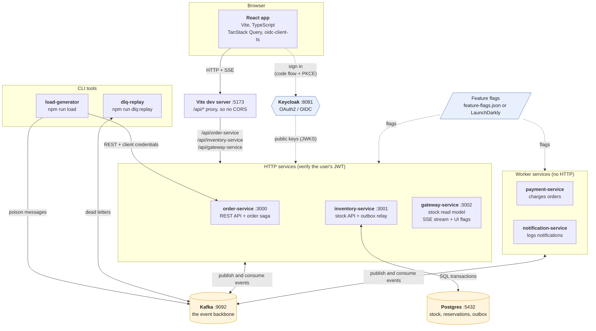
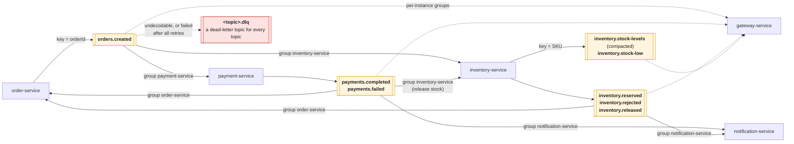
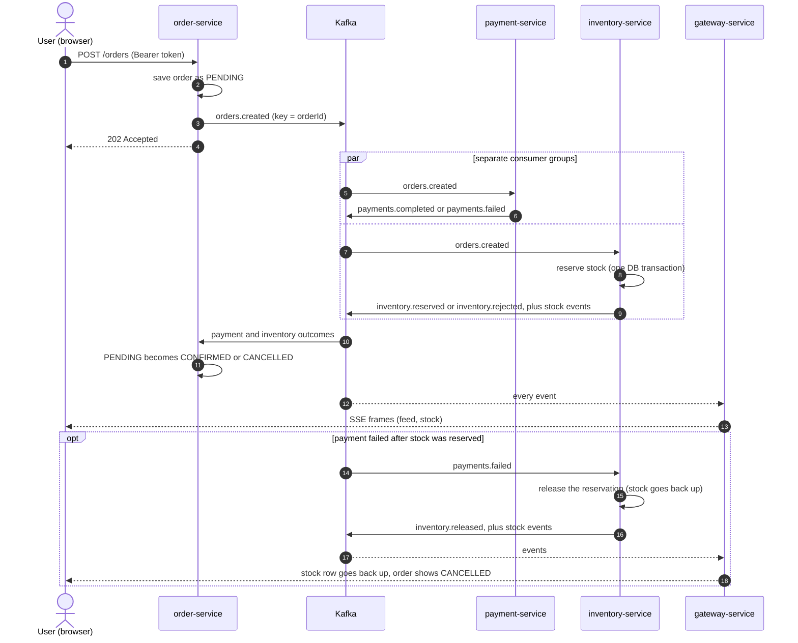
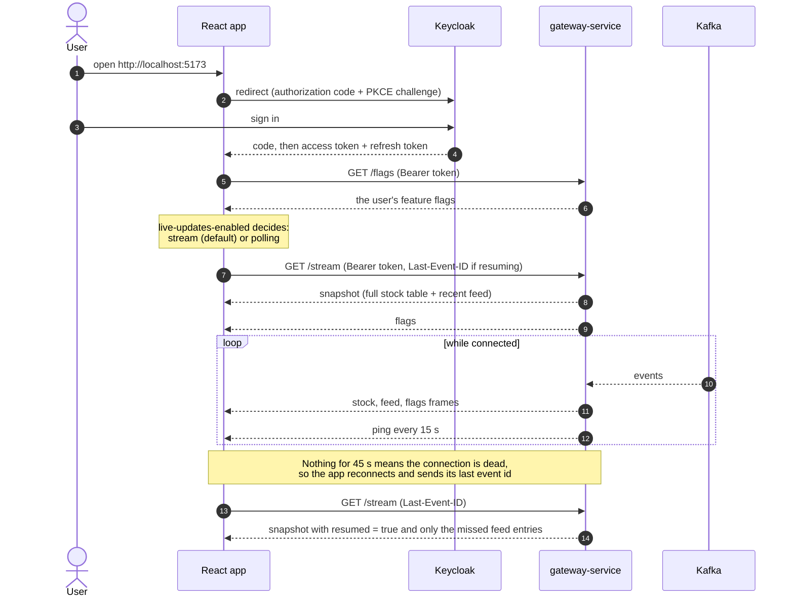
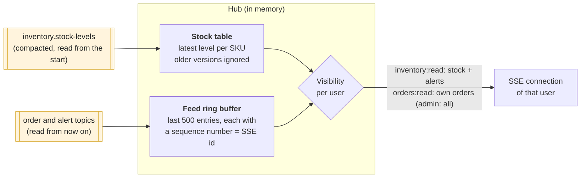
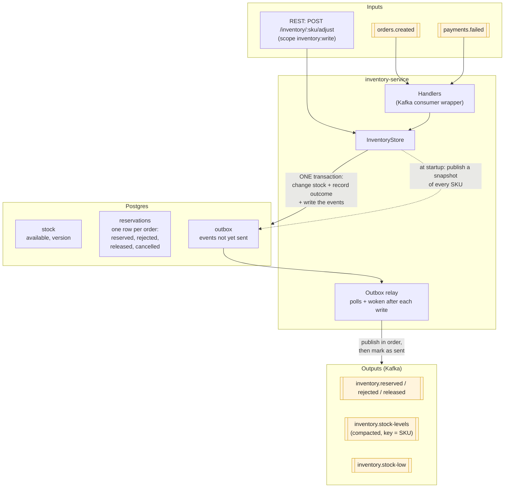
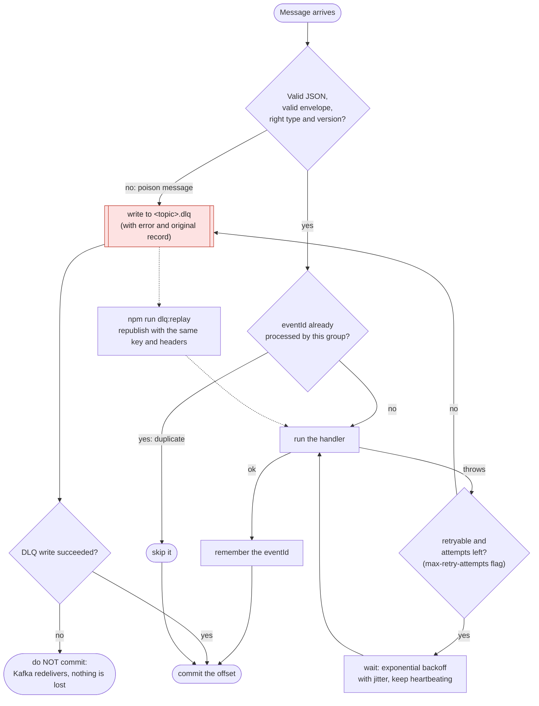
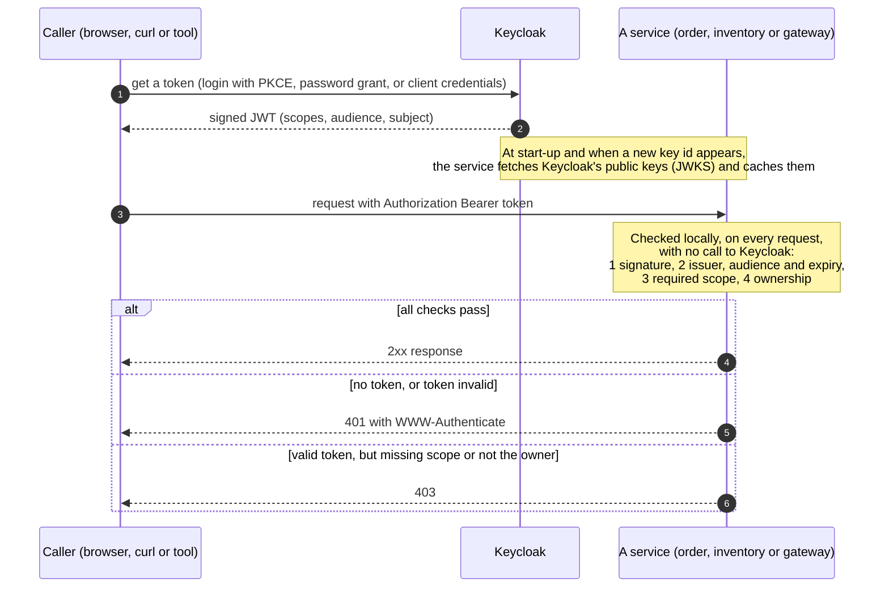
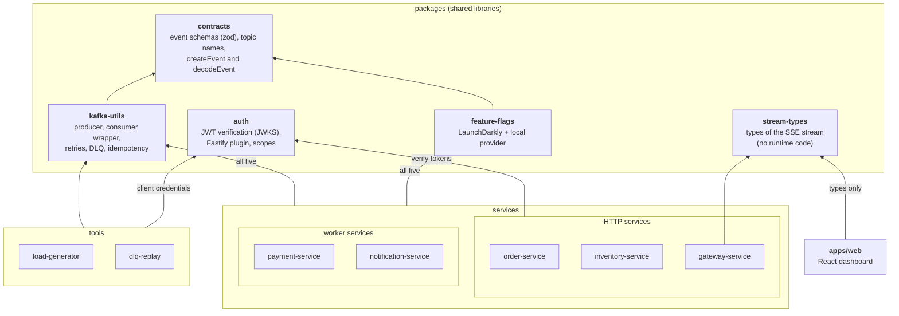

# Architecture

This page shows the whole system in diagrams, from the big picture down to the
details that matter in a demo. Every diagram is [Mermaid](https://mermaid.js.org/), so
it renders on GitHub and in most Markdown viewers. For the concepts behind the design
and how to present them, see [demo-guide.md](demo-guide.md). For step-by-step commands,
see [demo-script.md](demo-script.md).

| #   | Diagram                                                   | Answers                                                      |
| --- | --------------------------------------------------------- | ------------------------------------------------------------ |
| 1   | [System overview](#1-system-overview)                     | What runs, on which port, and who talks to whom?             |
| 2   | [Kafka topology](#2-kafka-topology)                       | Which topics exist, and who produces and consumes each one?  |
| 3   | [One order, end to end](#3-one-order-end-to-end)          | What happens when an order succeeds, and when payment fails? |
| 4   | [From Kafka to the browser](#4-from-kafka-to-the-browser) | How does a change in Kafka reach the page, safely?           |
| 5   | [Inside inventory-service](#5-inside-inventory-service)   | How are stock and events kept consistent?                    |
| 6   | [What every consumer does](#6-what-every-consumer-does)   | How are retries, duplicates and bad messages handled?        |
| 7   | [Security](#7-security)                                   | Who can call what, and how is a token checked?               |
| 8   | [Feature flags](#8-feature-flags)                         | Where do flag values come from, and who reads them?          |
| 9   | [Code structure](#9-code-structure)                       | How are the packages, services and apps related?             |

---

## 1. System overview

**Reading it.** Solid arrows carry data, dotted arrows are checks and configuration. The
four backend services never call each other: they only exchange events through Kafka.
The browser only ever talks to one origin (the Vite dev server), which forwards to the
three services that have an HTTP API.

| Component            | Port | Role                                                                           |
| -------------------- | ---- | ------------------------------------------------------------------------------ |
| Web app (Vite)       | 5173 | React dashboard and the dev proxy                                              |
| order-service        | 3000 | Accepts orders, runs the order state machine                                   |
| inventory-service    | 3001 | Owns stock in Postgres, publishes stock events through an outbox               |
| gateway-service      | 3002 | Turns Kafka events into a live stream for browsers; serves the web app's flags |
| payment-service      | –    | Consumer and producer only (no HTTP)                                           |
| notification-service | –    | Consumer only (no HTTP)                                                        |
| Kafka                | 9092 | Event backbone (single node, KRaft mode, no ZooKeeper)                         |
| Kafka UI             | 8080 | Browse topics, messages, consumer groups                                       |
| Keycloak             | 8081 | Identity provider (realm `orderflow`)                                          |
| Postgres             | 5432 | Durable state of inventory-service                                             |

---

## 2. Kafka topology

| Rule                                    | Why                                                                                                          |
| --------------------------------------- | ------------------------------------------------------------------------------------------------------------ |
| Key = `orderId` (order topics)          | All events for one order land on one partition, so they are consumed in order                                |
| Key = SKU (stock topics)                | All changes to one SKU stay in order; compaction keeps the newest record per SKU                             |
| One consumer group per service          | Every service sees every event; more instances of one service share its partitions                           |
| Gateway: one group set **per instance** | Every gateway instance must see every event to serve its own connected browsers                              |
| 3 partitions, 1 for each `.dlq`         | Parallelism for business topics; dead letters are rare and read by hand                                      |
| Topics are created by the services      | Broker auto-creation is off, so the layout is explicit in [`topics.ts`](../packages/contracts/src/topics.ts) |

---

## 3. One order, end to end

**Order state machine.** An order is `PENDING` until both answers arrive. It becomes
`CONFIRMED` if payment completed **and** stock was reserved, and `CANCELLED` as soon as
either fails. Final states stay final, and applying the same event twice changes nothing
([`order.ts`](../services/order-service/src/order.ts)).

**The race.** Payment and inventory run in parallel, so `payments.failed` can reach
inventory-service _before_ it has reserved anything. It records the order as `cancelled`,
and the late reservation is skipped ([`inventory.ts`](../services/inventory-service/src/inventory.ts)).

---

## 4. From Kafka to the browser

How the gateway builds what it sends ([`hub.ts`](../services/gateway-service/src/hub.ts)):

**Stock is state, the feed is events.** Stock is rebuilt from the compacted topic and sent in
full on every connect, so a client can never miss a stock change. The feed is a bounded
buffer: a reconnecting client sends `Last-Event-ID` and gets exactly the entries it missed. An
id from an older gateway run, or one already evicted, falls back to a fresh snapshot. A
restarted gateway starts with an empty feed, because the buffer is in memory.

---

## 5. Inside inventory-service

| Guarantee                  | How it is achieved                                                                                                                            |
| -------------------------- | --------------------------------------------------------------------------------------------------------------------------------------------- |
| No lost or invented events | The stock change and its events commit together (transactional outbox). A crash can't leave one without the other                             |
| At-least-once publishing   | The relay marks rows as sent after Kafka acknowledges. A crash in between means a resend, with the same event id                              |
| Safe to process twice      | One `reservations` row per order records the outcome. Output event ids are derived from the input event id, so duplicates collapse downstream |
| No overselling             | Stock rows are locked in SKU order inside the transaction; a reservation is all-or-nothing                                                    |
| Order of changes per SKU   | Each change bumps `version`; consumers ignore a stock event older than what they have                                                         |
| Table-like topic           | `inventory.stock-levels` is log-compacted: only the newest record per SKU is kept, so a new consumer can rebuild the table from the beginning |

---

## 6. What every consumer does

Every service reads Kafka through the same wrapper
([`consumer.ts`](../packages/kafka-utils/src/consumer.ts)), so these rules apply everywhere.

---

## 7. Security

| Who calls               | Keycloak client  | How it gets a token                                    |
| ----------------------- | ---------------- | ------------------------------------------------------ |
| A person in the web app | `orderflow-web`  | Authorization code flow with PKCE                      |
| A person with `curl`    | `orderflow-cli`  | Password grant (demo only, never for a real front end) |
| The load generator      | `load-generator` | Client credentials (a service identity)                |
| The DLQ replay operator | `dlq-replay`     | Client credentials, with the `admin` scope             |

| Scope             | Allows                                                                      | Where                      |
| ----------------- | --------------------------------------------------------------------------- | -------------------------- |
| `orders:write`    | `POST /orders`                                                              | order-service              |
| `orders:read`     | Read own orders (and see them on the stream)                                | order-service, gateway     |
| `inventory:read`  | `GET /inventory`; stock table and alerts on the stream                      | inventory-service, gateway |
| `inventory:write` | `POST /inventory/:sku/adjust`                                               | inventory-service          |
| `stream:read`     | Open `/stream`, `/snapshot`, `/flags` (the data scopes decide what you see) | gateway-service            |
| `admin`           | Read any order, replay DLQs                                                 | order-service, dlq-replay  |

Each scope adds its service to the token's `aud`, so a token meant for one service is
rejected by another. Events carry the user's identity (`actor`: `sub` and client) but **never
the token**. The gateway uses that `actor` to show each user only their own orders.

| Failure                                          | Response                          |
| ------------------------------------------------ | --------------------------------- |
| No token                                         | `401`, `WWW-Authenticate: Bearer` |
| Bad signature, expired, wrong issuer or audience | `401 invalid_token`               |
| Valid token, missing scope                       | `403 insufficient_scope`          |
| Valid token, someone else's order                | `403 access_denied`               |
| Keycloak's keys unreachable                      | `503` with `Retry-After`          |

---

## 8. Feature flags

```mermaid
flowchart LR
    ld{{"LaunchDarkly<br/>(when LD_SDK_KEY is set)"}}
    file[/"feature-flags.json<br/>watched, edit live"/]
    env[/"FLAG_* env vars"/]
    cli["npm run flag -- key value"]

    subgraph pkg["packages/feature-flags: one interface, two providers"]
        iface["FeatureFlags.get(key, context)<br/>never throws, falls back to a safe default"]
    end

    ld --> iface
    file --> iface
    env --> iface
    cli -- "edits" --> file

    subgraph backend["Backend flags (order and service contexts)"]
        f1["payment-failure-rate<br/>(chaos)"]
        f2["payment-consumer-enabled<br/>(kill switch)"]
        f3["fraud-check-enabled"]
        f4["notification-channel"]
        f5["max-retry-attempts<br/>(every consumer)"]
    end

    subgraph ui["Web app flags (user context)"]
        u1["live-updates-enabled"]
        u2["new-inventory-dashboard"]
        u3["bulk-adjust-enabled"]
        u4["activity-feed-size"]
    end

    iface --> backend
    iface --> gw["gateway-service<br/>evaluates for the signed-in user"]
    gw --> ui
    ui -- "GET /flags<br/>flags frame on /stream<br/>flags in /snapshot" --> web["React app<br/>(never sees an SDK key)"]
```

Every flag has a **safe default** that means normal, healthy behaviour. It is served
when LaunchDarkly is down, the flag is missing, or the value is invalid, so a flag outage
can never take the pipeline down. A flag change reaches running services within about a
second (local file) or as fast as LaunchDarkly streams it, and it reaches open browser
pages through the `flags` frame, without a reload.

---

## 9. Code structure

Every service also depends on `contracts` (directly or through `kafka-utils`). The web
app imports only **types** from `stream-types`, so no server code ends up in the browser.

| Path                                                              | What to read first                                                                              |
| ----------------------------------------------------------------- | ----------------------------------------------------------------------------------------------- |
| [`packages/contracts`](../packages/contracts/src)                 | `topics.ts`, `events.ts`, `envelope.ts`: the whole vocabulary of the system                     |
| [`packages/kafka-utils`](../packages/kafka-utils/src)             | `consumer.ts` (`processMessage`): validation, idempotency, retries, DLQ                         |
| [`services/inventory-service`](../services/inventory-service/src) | `inventory.ts`, `outbox.ts`, `migrations.ts`                                                    |
| [`services/gateway-service`](../services/gateway-service/src)     | `hub.ts` (read model, visibility, resume), `app.ts` (SSE endpoint), `ui-flags.ts`               |
| [`apps/web`](../apps/web/src)                                     | `live/LiveProvider.tsx` (stream, polling, watchdog), `live/reducer.ts`, `auth/AuthProvider.tsx` |
| [`infra/keycloak`](../infra/keycloak/realm-export.json)           | The realm: clients, scopes, audiences, demo users                                               |
